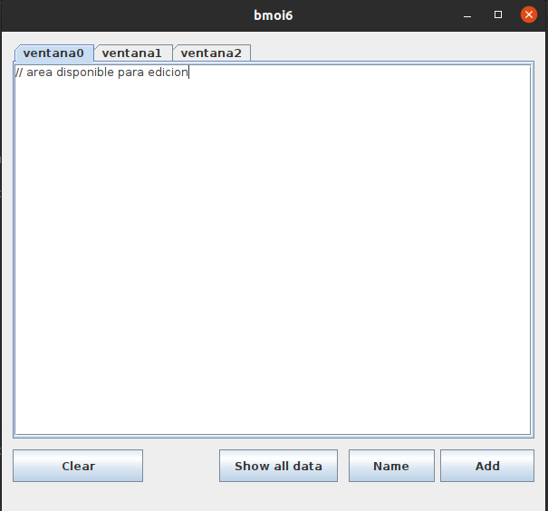

# Multiples pestañas 

### Objetivo

Crear pestañas y cada una de las pestañas contengan areas de texto para el usuario.

### Requisitos

- Apache Netbeans IDE

- JDK

### Ejecutar

`java -jar "dist/JtabbedPanel.jar"  `

### Fotos



### Codigo

- `pestanias` es un array de `JTextArea`
- `panel` es un objeto tipo`JTabbedPane`

#### Boton Add

```java
		JTextArea tmp = new JTextArea();
​       pestanias.add(tmp);
​       panel.add("ventana" + contador, new JScrollPane(tmp));
​       contador++;
```

Se ingresa el `JTextArea` en el`panel`y se incrementa el `contador` de pestañas.

#### Boton Name

Imprime el nombre de la pestaña que esta seleccionada.

```java
 System.out.println(panel.getTitleAt(panel.getSelectedIndex()));
```

`getSelectedIndex`() retorna el index del tab seleccionado.

#### Boton Show all data

Muestra el texto que tiene cada una de las pestañas

```java
   for (int i = 0; i < pestanias.size(); i++) {
       JOptionPane.showMessageDialog(null, pestanias.get(i).getText());
   }
```
